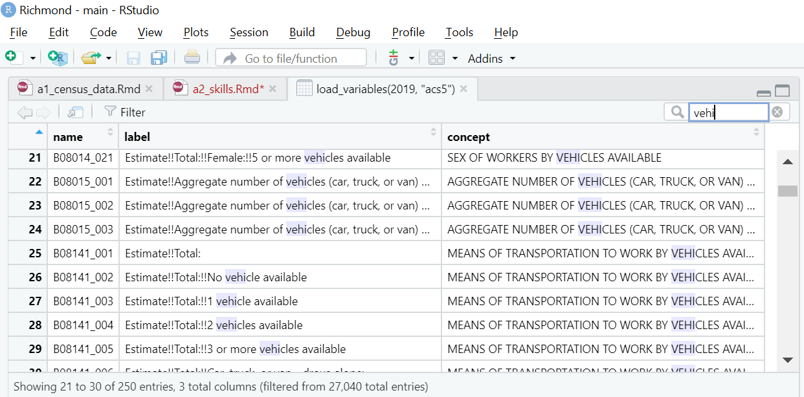

```{r setup, include=FALSE}
knitr::opts_chunk$set(echo = TRUE)
```

# Overview

The followings skills will be useful for Analysis Assignment 2. They are listed here alphabetically. I don't want to bias your thinking about which ones you'll end up using and in what order. But this page will be a useful reference.

*Note: In general, you should load all your libraries at the beginning of your script or markdown file. In these examples, I'm loading libraries at the top of each code chunk to make it more clear which methods use which packages.*

* **Add households or jobs to a tract**: Your proposed alternative might involve a land use change that would add households or jobs to one or more specific tracts.
* **Apply a ggplot theme:** You have a lot of flexibility in designing your ggplot charts and maps, but some pre-defined themes can save you some time on that.
* **Calculate an area:** A lot of the variables you're likely to be working with are counts (e.g. number of households or number of jobs). When you show those on a chloropleth map, you might decide that a density (e.g. jobs or households per square mile) is more informative. Or you might even decide a density is one of the variables you want to include in your model. Before you can calculate a density, you'll need to calculate the area of each zone (for example, in square miles or square kilometers).
* **Calculate new variables:** When you download data from the census or from LEHD, you might need to combine multiple variables together to get the variable you actually want. For example, you might need to add the number of households in each of multiple income categories to get the number in a combined income category, or you might need to divide the number of jobs by the area of each tract to get an employment density.
* **Collapse data:** This is useful if you want to collapse block-level data to the tract level, or tract-level data to the region level.
* **Convert units:** When you calculate an area, the result will be in the units of your projected coordinate system (typically feet or meters). You may want to convert the units to something like acres or square miles.
* **Create a chloropleth map:** A static chloropleth map is a useful way to display variation across space on a figure you want to include in report.
* **Create a histogram:** A histogram is a helpful way to illustrate the variation in a variable.
* **Create an interactive map:** Even if your deliverable will be all static content in a report, it can be helpful to create an interactive map for your own use to explore your data. For example, it's a useful way to find the GEOID for a zone in a specific location.
* **Define a color scale:** There are several predefined color palettes you can use, and some useful functions you can use to select colors in `ggplot`.
* **Define study area boundary:** In this class, your study area is a metropolitan statistical area. You can use the `tigris` or `tidycensus` package to get the boundary of your study area. This can be especially useful if your study area includes many counties.
* **Distribute growth evenly**: Your proposed alternative might involve increasing the population or employment by a constant percentage across all zones.
* **Download census tract data:** You'll need to download several tract-level variables from the census. You'll find the `tidycensus` package super useful for this.
* **Download employment data:** The Longitudinal Employer-Household Dynamica (LEHD) dataset is a great source of census-block level employment data by industry.
* **Find census variables:** You'll need to search for the names of the variables you want to include in your analysis.
* **Format scale labels:** You may not be happy with the default tick-mark labels on your plot. These are easy to customize.
* **Get regional data:** Your analysis will be at the tract level, but you might want to calculate some regional-level statistics as well - either because you want to just give a description of the region as a whole in your report or because you want to calculate a variable that reports tract-level statistics to regional statistics (e.g. income relative to the regional median).
* **Join two data frames:** If you have employment data in one dataframe and population data in another, you'll want to combine them into a single column.
* **List census variable names:** Once you've identified the census variable you want to include in your analysis, you can create a list of them in which you define your own variable names.
* **Log-transform a color scale:** If you find that your chloropleth map doesn't show a lot of variation, you could try log-transforming the scale to emphasize variation in low values and deemphasize a small number of high values.
* **Organize data columns:** You can use the `select()` function to delete variables you don't need and also to reorder columns.
* **Summarize tract statistics:** Histograms and maps are great, but a table can also be really informative.

# Add households or jobs to a tract

Your proposed alternative might involve a land use change that would add households or jobs to one or more specific tracts.

# Apply a ggplot theme

You have a lot of flexibility in designing your ggplot charts and maps, but some pre-defined themes can save you some time on that.

```{r}

```


# Calculate an area

A lot of the variables you're likely to be working with are counts (e.g. number of households or number of jobs). When you show those on a chloropleth map, you might decide that a density (e.g. jobs or households per square mile) is more informative. Or you might even decide a density is one of the variables you want to include in your model. Before you can calculate a density, you'll need to calculate the area of each zone (for example, in square miles or square kilometers).

# Calculate new variables

When you download data from the census or from LEHD, you might need to combine multiple variables together to get the variable you actually want. For example, you might need to add the number of households in each of multiple income categories to get the number in a combined income category, or you might need to divide the number of jobs by the area of each tract to get an employment density.

# Collapse data

This is useful if you want to collapse block-level data to the tract level.

```{r}

```


# Convert units 

When you calculate an area, the result will be in the units of your projected coordinate system (typically feet or meters). You may want to convert the units to something like acres or square miles.

# Create a chloropleth map 

A static chloropleth map is a useful way to display variation across space on a figure you want to include in report.

# Create a histogram 

A histogram is a helpful way to illustrate the variation in a variable.

# Create an interactive map

Even if your deliverable will be all static content in a report, it can be helpful to create an interactive map for your own use to explore your data. For example, it's a useful way to find the GEOID for a zone in a specific location.

# Define a color scale

There are several predefined color palettes you can use, and some useful functions you can use to select colors in `ggplot`.

# Define study area boundary

```{r}

```


In this class, your study area is a metropolitan statistical area. You can use the `tigris` or `tidycensus` package to get the boundary of your study area. This can be especially useful if your study area includes many counties.

# Distribute growth evenly

Your proposed alternative might involve increasing the population or employment by a constant percentage across all zones.

# Download census tract data

You'll need to download several tract-level variables from the census. You'll find the `tidycensus` package super useful for this.

Assuming you've already [defined a list of variables](https://gsd-ses-5394-s2022.github.io/Richmond/a2_skills.html#list-census-variable-names) and saved it as a [character vector](https://r4ds.had.co.nz/vectors.html){target="_blank"} called `vars`, you can use the `get_acs()` function in the `tidycensus` package to download the data. 

```{r, echo = FALSE}
vars <- c(total_hhs = 'B08203_001',
          no_veh = 'B08203_002',
          lo_veh2w_1v = 'B08203_021',
          lo_veh3w_1v = 'B08203_027',
          lo_veh3w_2v = 'B08203_028',
          hh_1person = 'B08201_007',
          hh_2person = 'B08201_013',
          hh_3person = 'B08201_019',
          hh_4person_fam = 'B11016_005',
          hh_4person_nfam = 'B11016_013',
          hh_5person_fam = 'B11016_006',
          hh_5person_nfam = 'B11016_014',
          hh_6person_fam = 'B11016_007',
          hh_6person_nfam = 'B11016_015',
          hh_7person_fam = 'B11016_008',
          hh_7person_nfam = 'B11016_016',
          inc_lt_10k = 'B19001_002',
          inc_btw_10k_15k = 'B19001_003',
          inc_btw_15k_20k = 'B19001_004',
          inc_btw_20k_25k = 'B19001_005',
          inc_btw_25k_30k = 'B19001_006',
          inc_btw_30k_35k = 'B19001_007',
          inc_btw_35k_40k = 'B19001_008',
          inc_btw_40k_45k = 'B19001_008',
          inc_btw_45k_50k = 'B19001_010',
          inc_btw_50k_60k = 'B19001_011',
          inc_btw_60k_75k = 'B19001_012',
          inc_btw_75k_100k = 'B19001_013',
          inc_btw_100k_125k = 'B19001_014',
          inc_btw_125k_150k = 'B19001_015',
          inc_btw_150k_200k = 'B19001_016',
          inc_gt_200k = 'B19001_017')
```

I'll use the `get_acs()` function from the `tidycensus` package. `geography = 'tract'` means I want tract-level data. I'll also specify the state and county (or counties - I can provide a list of all the counties in my study area here if there is more than one). In most cases, I'll set `output = wide` because I want each variable in its own column (you can see an exception [here]() though).

```{r}
library(tidycensus)

zones <- get_acs(geography = 'tract',
                 state = 'MA',
                 county = c('Suffolk', 'Middlesex'),
                 variables = vars,
                 output = 'wide')
```


# Download employment data

The Longitudinal Employer-Household Dynamica (LEHD) dataset is a great source of census-block level employment data by industry.

# Find census variables

You'll need to search for the names of the variables you want to include in your analysis.

If you've already loaded the `tidycensus` package, you can type `View(load_variables(2019, "acs5"))`^[The first argument (`2019`) indicates that you want the variables that are available for 2019 and the second argument (`"acs5"`) indicates that you want variables that are included in the 5-year sample of the American Community Survey. The 5-year sample is from survey respondents pooled over a 5-year period. An alternative is `"acs1"`, which would give you just the households who completed the survey in 2019 (which is a much smaller sample, so those estimates would have more uncertainty associated with them). You could also specify `"sf1"` instead of `"acs5"` or `"acs1"` if you wanted data from the decennial census. The decennial census is meant to include everyone, so there is no sampling error, but fewer variables are available. 
] into your console to interactively search for variables that you'd like to include in your analysis. That will open a table of all the available variables in your viewer. Here's what you'll see if you start searching for variables that have to do with vehicles:



You'll see that the table has three columns. 

* The first column is the variable name. The variable name will have two parts: the part before the underscore tells you which table the variable is a part of, that the part after the underscore tells you which row the variable is in. 
* The second column is the variable label. This describes that specific variable.
* The third column, called "concept," is the name of the table identified in the first part of the variable name.

Many tables are cross-tabulations that present the number of people, homes, or households in each combination of two categories. Many values can be found in multiple tables. For example, you can find the total number of workers who commute to work by car in B08006 (Sex of worker by means of transportation to work) and B08101 (Means of transportation to work by age).

# Format scale labels

You may not be happy with the default tick-mark labels on your plot. These are easy to customize.

# Get regional data

Your analysis will be at the tract level, but you might want to calculate some regional-level statistics as well - either because you want to just give a description of the region as a whole in your report or because you want to calculate a variable that reports tract-level statistics to regional statistics (e.g. income relative to the regional median).

The example here incorporates some of the skills covered in other sections.

In this example, I want to have some tract-level variables that indicate how many households are in each income quintile, so I'll calculate the regional 20th, 40th, 60th, and 80th percentiles to use as thresholds.

First I'll [create a list of variables](https://gsd-ses-5394-s2022.github.io/Richmond/a2_skills.html#list-census-variable-names) indicating the number of households in each of 16 income categories. 

```{r}
vars <- c(inc_lt_10k = 'B19001_002',
          inc_btw_10k_15k = 'B19001_003',
          inc_btw_15k_20k = 'B19001_004',
          inc_btw_20k_25k = 'B19001_005',
          inc_btw_25k_30k = 'B19001_006',
          inc_btw_30k_35k = 'B19001_007',
          inc_btw_35k_40k = 'B19001_008',
          inc_btw_40k_45k = 'B19001_008',
          inc_btw_45k_50k = 'B19001_010',
          inc_btw_50k_60k = 'B19001_011',
          inc_btw_60k_75k = 'B19001_012',
          inc_btw_75k_100k = 'B19001_013',
          inc_btw_100k_125k = 'B19001_014',
          inc_btw_125k_150k = 'B19001_015',
          inc_btw_150k_200k = 'B19001_016',
          inc_gt_200k = 'B19001_017')
```

Then I'll [download those variables](https://gsd-ses-5394-s2022.github.io/Richmond/a2_skills.html#download-census-tract-data) for all the core-based statistical areas in United States (`geography = metropolitan statistical area/micropolitan statistical area"` instead of `geography = "tract"`). I am *not* setting `output = 'wide'` because in this case I actually *do* want each variable in its own row (there will be a column with the variable name and column called `estimate` with the value of each variable). I'm setting `summary_var = 'B19001_001'` because that's the total number of households, and I want to calculate what percent of total households fall in each category.

After a pipe (`%>%`) I filter the data to only include my study area (I'm using Richmond in this example - the GEOID is 40060).

After another pipe, I [create a variable](https://gsd-ses-5394-s2022.github.io/Richmond/a2_skills.html#calculate-new-variables) with the percent of households in each category, and then I use the `cumsum()` function to calculate a cumulative percentage. Finally, I [delete the columns](https://gsd-ses-5394-s2022.github.io/Richmond/a2_skills.html#organize-data-columns) I don't need, keeping only the cumulative percentage and variable names.

Now I can [print the table](https://gsd-ses-5394-s2022.github.io/Richmond/a2_skills.html#summarize-tract-statistics).

```{r, message=FALSE}
library(tidycensus)
library(tidyverse)
library(knitr)

region_inc <- get_acs(
  geography = "metropolitan statistical area/micropolitan statistical area",
  variables = vars,
  summary_var = 'B19001_001') %>%
  filter(GEOID == "40060") %>%
  mutate(pct = estimate / summary_est) %>%
  mutate(cumul_pct = cumsum(pct)) %>%
  select(variable, cumul_pct)

kable(region_inc, digits=2)
```

From the table above, I can see that 20 percent of households have incomes below \$30,000 per year, 40 percent have incomes below \$60,000 per year, 60 percent (or close enough) have incomes below \$100,000, and 80 percent have incomes below \$150,000 per year. These are thresholds I could use to define broader income categories for my tract-level data. 


# Join two data frames

If you have employment data in one dataframe and population data in another, you'll want to combine them into a single column.

# List census variable names

Once you've [identified the census variable you want to include in your analysis](https://gsd-ses-5394-s2022.github.io/Richmond/a2_skills.html#find-census-variables), you can create a list of them. The function `c()` lets you list a bunch of items so you can pass them into another function (for example, the [`get_acs()`](https://gsd-ses-5394-s2022.github.io/Richmond/a2_skills.html#download-census-tract-data) function) as a single argument. You could just list all the variable names you've identified like this:

```{r}
vars <- c('B08203_001',
          'B08203_002',
          'B08203_021',
          'B08203_027',
          'B08203_028',
          'B08201_007',
          'B08201_013',
          'B08201_019',
          'B11016_005',
          'B11016_013',
          'B11016_006',
          'B11016_014',
          'B11016_007',
          'B11016_015',
          'B11016_008',
          'B11016_016',
          'B19001_002',
          'B19001_003',
          'B19001_004',
          'B19001_005',
          'B19001_006',
          'B19001_007',
          'B19001_008',
          'B19001_008',
          'B19001_010',
          'B19001_011',
          'B19001_012',
          'B19001_013',
          'B19001_014',
          'B19001_015',
          'B19001_016',
          'B19001_017')
```

But remember that you don't only want computers to be able to read your code. You want humans (including your future self) to be able to read it too. To that end, you can also define more intelligible variable names when you list your variables.

```{r}
vars <- c(total_hhs = 'B08203_001',
          no_veh = 'B08203_002',
          lo_veh2w_1v = 'B08203_021',
          lo_veh3w_1v = 'B08203_027',
          lo_veh3w_2v = 'B08203_028',
          hh_1person = 'B08201_007',
          hh_2person = 'B08201_013',
          hh_3person = 'B08201_019',
          hh_4person_fam = 'B11016_005',
          hh_4person_nfam = 'B11016_013',
          hh_5person_fam = 'B11016_006',
          hh_5person_nfam = 'B11016_014',
          hh_6person_fam = 'B11016_007',
          hh_6person_nfam = 'B11016_015',
          hh_7person_fam = 'B11016_008',
          hh_7person_nfam = 'B11016_016',
          inc_lt_10k = 'B19001_002',
          inc_btw_10k_15k = 'B19001_003',
          inc_btw_15k_20k = 'B19001_004',
          inc_btw_20k_25k = 'B19001_005',
          inc_btw_25k_30k = 'B19001_006',
          inc_btw_30k_35k = 'B19001_007',
          inc_btw_35k_40k = 'B19001_008',
          inc_btw_40k_45k = 'B19001_008',
          inc_btw_45k_50k = 'B19001_010',
          inc_btw_50k_60k = 'B19001_011',
          inc_btw_60k_75k = 'B19001_012',
          inc_btw_75k_100k = 'B19001_013',
          inc_btw_100k_125k = 'B19001_014',
          inc_btw_125k_150k = 'B19001_015',
          inc_btw_150k_200k = 'B19001_016',
          inc_gt_200k = 'B19001_017')
```


# Log-transform a color scale

If you find that your chloropleth map doesn't show a lot of variation, you could try log-transforming the scale to emphasize variation in low values and deemphasize a small number of high values.

# Organize data columns

You can use the `select()` function to delete variables you don't need and also to reorder columns.

# Summarize tract statistics

Histograms and maps are great, but a table can also be really informative.


